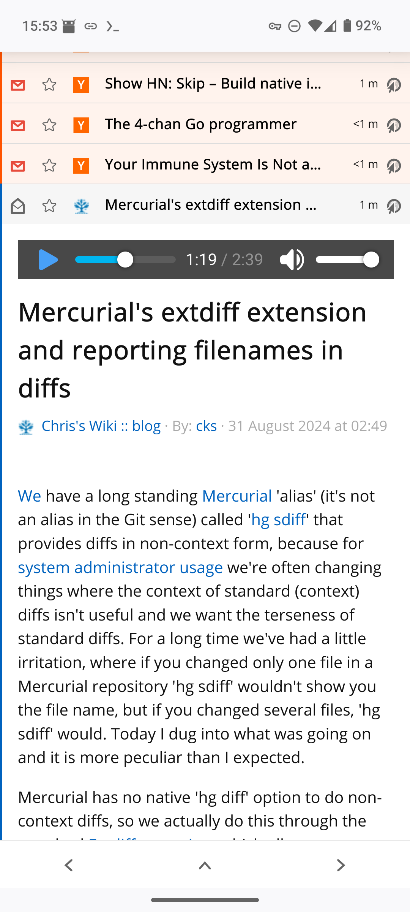

Calls Piper TTS when you want to listen to article.

[Demo video](https://autkin.net/tmp/tts/demo.mp4)

You have to install stuff:

* apt update && apt install -y w3m ffmpeg time
* copy over /usr/share/piper from piper docker image
* use non-Alpine FreshRSS image
* download and mount piper-voices: e.g. git clone https://huggingface.co/rhasspy/piper-voices
